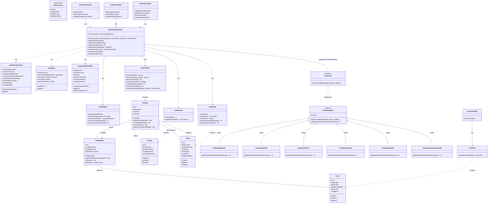

```mermaid
classDiagram
    %% --- MODELOS (Entidades Ricas) ---
    class Usuario {
        -int id
        -String nome
        -int pontos
        -int streak
        +Usuario()
        +ganharPontos(int qtd) void
        +incrementarStreak() void
        +resetarStreak() void
        +registrarLeitura(LocalDate) void
    }

    class StatusLeitura {
        <<enumeration>>
        LENDO
        CONCLUIDO
        QUERO_LER
        ABANDONADO
    }

    class ItemEstante {
        -int id
        -int paginasTotal
        -int paginasLidas
        -StatusLeitura status
        +ItemEstante()
        +registrarProgresso(int paginas) void
        +concluir() void
        +getStatus() StatusLeitura
    }

    class Leitura {
        -int id
        -int usuarioId
        -String livroTitulo
        -int paginasLidas
        -String dataLeitura
        +Leitura()
        +getters()
        +setters()
    }

    class Livro {
        -int id
        -String titulo
        -String autor
        -double notaMedia
        -String isbn
        -int paginas
        +Livro()
        +getters()
        +setters()
    }

    class Clube {
        -int id
        -String nome
        -String descricao
        -String foto
        -String capa
        -int donoId
        -boolean publico
        +Clube()
        +getters()
        +setters()
    }

    class EstatisticasUsuario {
        -int totalPaginasLidas
        -int totalLivrosLidos
        -int totalLivrosNaEstante
        -int totalLivrosConcluidosEstante
        -int totalClubesParticipando
        -int totalClubesCriados
        -int streakAtual
        -int pontosTotais
        +EstatisticasUsuario(...)
        +getters()
    }

    class PerfilDTO {
        -Usuario usuario
        -List~ConquistaStatusDTO~ conquistas
        -List~Leitura~ historicoRecente
        -List~Clube~ clubes
        -List~ItemEstante~ estante
        +PerfilDTO(...)
        +getters()
    }

    class ConquistaStatusDTO {
        -String nome
        -String descricao
        -int bonus
        -boolean alcancada
        -int progressoAtual
        -int progressoAlvo
        +ConquistaStatusDTO(...)
        +getters()
        +getPorcentagem() int
    }

    %% --- CONQUISTAS (Padrão Template Method) ---
    class Conquista {
        <<interface>>
        +isAlcancada(EstatisticasUsuario) boolean
    }

    class ConquistaBase {
        <<abstract>>
        #int alvo
        +isAlcancada(EstatisticasUsuario) boolean
        +getProgressoAtual(EstatisticasUsuario)* int
        %% Nota: isAlcancada usa getProgressoAtual (Template Method)
    }

    class ConquistaPaginas {
        +getProgressoAtual(EstatisticasUsuario) int
    }
    class ConquistaStreak {
        +getProgressoAtual(EstatisticasUsuario) int
    }
    class ConquistaPontos {
        +getProgressoAtual(EstatisticasUsuario) int
    }
    class ConquistaEstante {
        +getProgressoAtual(EstatisticasUsuario) int
    }
    class ConquistaClubes {
        +getProgressoAtual(EstatisticasUsuario) int
    }
    class ConquistaLeituraConcluida {
        +getProgressoAtual(EstatisticasUsuario) int
    }

    %% --- DAOs (Acesso a Dados) ---
    class UsuarioDAO {
        +buscarPorId(int) Usuario
        +autenticar(String, String) Usuario
        +adicionarPontos(int, int)
        +atualizarStreak(int, int, String)
        +contarPaginasLidas(int) int
        +contarLivrosLidos(int) int
        +listarRankingFiltrado(Integer, String) List~Usuario~
    }

    class LeituraDAO {
        +salvar(Leitura)
        +listarPorUsuario(int) List~Leitura~
    }

    class ClubeDAO {
        +criar(Clube)
        +listarTodos() List~Clube~
        +entrar(int, int, String)
        +contarClubesParticipando(int) int
        +contarClubesCriados(int) int
    }

    class EstanteDAO {
        +adicionar(ItemEstante)
        +atualizarProgresso(int, int, String)
        +listarPorUsuario(int) List~ItemEstante~
        +contarLivrosNaEstante(int) int
        +contarLivrosConcluidos(int) int
    }

    class LivroDAO {
        +buscarPorTitulo(String) List~Livro~
    }

    %% --- SERVICE (Regra de Negócio) ---
    class GamificacaoService {
        -List~Conquista~ conquistasDisponiveis
        +GamificacaoService(UsuarioDAO, LeituraDAO, ClubeDAO, EstanteDAO)
        +registrarLeitura(Leitura)
        +iniciarLeitura(ItemEstante)
        +registrarProgresso(int, int)
        +obterPerfilCompleto(int) PerfilDTO
        -coletarEstatisticas(int) EstatisticasUsuario
        -verificarConquistas(int)
        -inicializarConquistas()
    }

    %% --- CONTROLLERS (API) ---
    class LeituraController {
        +registrarLeitura(Context)
        +listarHistorico(Context)
        +verPerfil(Context)
        +listarRanking(Context)
    }

    class ClubeController {
        +listarClubes(Context)
        +criarClube(Context)
        +entrarNoClube(Context)
    }

    class EstanteController {
        +listar(Context)
        +iniciarLeitura(Context)
        +atualizarProgresso(Context)
    }

    class LivroController {
        +buscar(Context)
    }

    %% --- RELAÇÕES ---
    
    %% Herança e Implementação
    Conquista <|.. ConquistaBase : implementa
    ConquistaBase <|-- ConquistaPaginas : herda
    ConquistaBase <|-- ConquistaStreak : herda
    ConquistaBase <|-- ConquistaPontos : herda
    ConquistaBase <|-- ConquistaEstante : herda
    ConquistaBase <|-- ConquistaClubes : herda
    ConquistaBase <|-- ConquistaLeituraConcluida : herda

    %% Dependências do Service
    GamificacaoService --> UsuarioDAO : usa
    GamificacaoService --> LeituraDAO : usa
    GamificacaoService --> ClubeDAO : usa
    GamificacaoService --> EstanteDAO : usa
    GamificacaoService o-- Conquista : agrega (lista de conquistas)
    GamificacaoService ..> EstatisticasUsuario : cria
    GamificacaoService ..> PerfilDTO : cria
    GamificacaoService ..> ConquistaStatusDTO : cria

    %% Dependências dos Controllers
    LeituraController --> GamificacaoService : usa
    ClubeController --> GamificacaoService : usa
    EstanteController --> GamificacaoService : usa
    LivroController --> LivroDAO : usa

    %% Dependências de Retorno (DAOs)
    LivroDAO ..> Livro : recupera
    UsuarioDAO ..> Usuario : recupera
    ClubeDAO ..> Clube : recupera
    EstanteDAO ..> ItemEstante : recupera
    LeituraDAO ..> Leitura : recupera

    %% Associações de Modelo (Conceituais)
    Usuario "1" -- "*" Leitura : realiza
    Usuario "1" -- "*" ItemEstante : possui
    Usuario "1" -- "*" Clube : participa
    Clube "1" -- "*" Usuario : tem membros
    ItemEstante "*" -- "1" Livro : refere-se
```
