# Diagrama de Classes UML - Projeto Literato

Este diagrama representa a estrutura arquitetural completa do sistema, detalhando atributos, métodos e relacionamentos reais extraídos do código-fonte.

```mermaid
classDiagram
    %% --- CAMADA MODEL (Domínio) ---
    namespace model {
        class Usuario {
            -int id
            -String nome
            -String senha
            -int pontos
            -int streak
            -String ultimaLeitura
            -String bio
            -String foto
            +getId() int
            +getNome() String
            +getPontos() int
            +getStreak() int
            +ganharPontos(int qtd)
            +incrementarStreak()
            +registrarLeitura(LocalDate data)
        }

        class Clube {
            -int id
            -String nome
            -String descricao
            -String foto
            -String capa
            -int donoId
            -boolean publico
            +getId() int
            +getNome() String
            +isPublico() boolean
            +getDonoId() int
        }

        class Livro {
            -int id
            -String titulo
            -String autor
            -double notaMedia
            -String isbn
            -int paginas
            +getTitulo() String
            +getAutor() String
            +getPaginas() int
        }

        class ItemEstante {
            -int id
            -int usuarioId
            -int livroId
            -String titulo
            -String autor
            -int paginasTotal
            -int paginasLidas
            -StatusLeitura status
            +registrarProgresso(int paginas)
            +concluir()
            +getStatus() StatusLeitura
        }

        class Leitura {
            -Integer id
            -Integer usuarioId
            -String livroTitulo
            -int paginasLidas
            -String dataLeitura
            +getId() Integer
            +getUsuarioId() Integer
            +getLivroTitulo() String
            +getPaginasLidas() int
            +getDataLeitura() String
        }

        class PerfilDTO {
            -Usuario usuario
            -List~ConquistaStatusDTO~ conquistas
            -List~Leitura~ historicoRecente
            -List~Clube~ clubes
            -List~ItemEstante~ estante
            -List~Integer~ solicitacoesPendentes
        }

        class EstatisticasUsuario {
            -int totalPaginasLidas
            -int totalLivrosLidos
            -int totalLivrosNaEstante
            -int totalLivrosConcluidosEstante
            -int totalClubesParticipando
            -int totalClubesCriados
            -int streakAtual
            -int pontosTotais
            +getTotalPaginasLidas() int
            +getTotalLivrosLidos() int
            +getTotalLivrosNaEstante() int
            +getTotalLivrosConcluidosEstante() int
            +getTotalClubesParticipando() int
            +getTotalClubesCriados() int
            +getStreakAtual() int
            +getPontosTotais() int
        }
        
        class ConquistaStatusDTO {
            -String nome
            -String descricao
            -int bonus
            -boolean alcancada
            -int progressoAtual
            -int progressoAlvo
            +getPorcentagem() int
        }

        class StatusLeitura {
            <<enumeration>>
            LENDO
            CONCLUIDO
            QUERO_LER
            ABANDONADO
        }

        %% Polimorfismo de Conquistas
        class Conquista {
            <<interface>>
            +getNome() String
            +getDescricao() String
            +getBonus() int
            +getProgressoAlvo() int
            +isAlcancada(EstatisticasUsuario stats) boolean
            +getProgressoAtual(EstatisticasUsuario stats) int
        }

        class ConquistaBase {
            <<abstract>>
            #String nome
            #String descricao
            #int bonus
            #int alvo
            +isAlcancada(EstatisticasUsuario stats) boolean
            +getProgressoAtual(EstatisticasUsuario stats)* int
        }

        class ConquistaPaginas {
            +getProgressoAtual(EstatisticasUsuario stats) int
        }
        class ConquistaStreak {
            +getProgressoAtual(EstatisticasUsuario stats) int
        }
        class ConquistaClubes {
            +getProgressoAtual(EstatisticasUsuario stats) int
        }
        class ConquistaEstante {
            +getProgressoAtual(EstatisticasUsuario stats) int
        }
        class ConquistaLeituraConcluida {
            +getProgressoAtual(EstatisticasUsuario stats) int
        }
        class ConquistaPontos {
            +getProgressoAtual(EstatisticasUsuario stats) int
        }
    }

    %% --- CAMADA DAO (Persistência) ---
    namespace dao {
        class Database {
            +connect() Connection
            +initialize() void
        }

        class UsuarioDAO {
            +buscarPorId(int id) Usuario
            +autenticar(String nome, String senha) Usuario
            +adicionarPontos(int id, int pontos)
            +atualizarStreak(int id, int streak, String data)
            +atualizarPerfil(int id, String bio, String foto)
            +listarRankingFiltrado(Integer clubeId, String periodo) List~Usuario~
        }

        class ClubeDAO {
            +criar(Clube c)
            +atualizar(Clube c)
            +listarTodos() List~Clube~
            +entrar(int usuarioId, int clubeId, String cargo)
            +isMembro(int usuarioId, int clubeId) boolean
            +listarMembrosComCargo(int clubeId) List
            +listarSolicitacoes(int clubeId)
            +responderSolicitacao(int solId, boolean aceitar)
            +excluir(int clubeId)
            +sair(int usuarioId, int clubeId)
            +atualizarCargo(int clubeId, int usuarioId, String cargo)
            +transferirDono(int clubeId, int novoDono, int antigoDono)
        }

        class LeituraDAO {
            +salvar(Leitura l)
            +listarPorUsuario(int usuarioId) List~Leitura~
        }

        class EstanteDAO {
            +adicionar(ItemEstante item)
            +atualizarProgresso(int id, int paginas, StatusLeitura status)
            +atualizarStatus(int id, StatusLeitura status)
            +listarPorUsuario(int usuarioId) List~ItemEstante~
            +buscarPorId(int id) ItemEstante
            +excluir(int id)
        }
        
        class LivroDAO {
            +buscarPorTitulo(String termo) List~Livro~
        }
    }

    %% --- CAMADA SERVICE (Regra de Negócio) ---
    namespace service {
        class GamificacaoService {
            -UsuarioDAO usuarioDAO
            -LeituraDAO leituraDAO
            -ClubeDAO clubeDAO
            -EstanteDAO estanteDAO
            -List~Conquista~ conquistasDisponiveis
            +registrarLeitura(Leitura leitura)
            +iniciarLeitura(ItemEstante item)
            +registrarProgresso(int itemEstanteId, int paginas)
            +editarProgressoAbsoluto(int itemEstanteId, int paginas)
            +atualizarStatusEstante(int id, String status)
            +removerDaEstante(int id)
            +listarEstante(int usuarioId) List~ItemEstante~
            +obterPerfilCompleto(int usuarioId) PerfilDTO
            +obterRanking(Integer clubeId, String periodo) List~Usuario~
            +criarClube(Clube clube)
            +entrarNoClube(int usuarioId, int clubeId)
            +responderSolicitacaoClube(int solId, boolean aceitar, int donoId)
            +excluirClube(int clubeId, int usuarioId)
            +sairDoClube(int clubeId, int usuarioId)
            +alterarCargoMembro(int clubeId, int usuarioAlvo, String cargo, int usuarioLogado)
            +expulsarMembro(int clubeId, int usuarioExpulso, int usuarioLogado)
        }
    }

    %% --- CAMADA CONTROLLER (Interface HTTP) ---
    namespace controller {
        class LeituraController {
            -GamificacaoService service
            +realizarLogin(Context ctx)
            +criarUsuario(Context ctx)
            +buscarUsuario(Context ctx)
            +verPerfil(Context ctx)
            +listarRanking(Context ctx)
            +atualizarPerfil(Context ctx)
        }

        class ClubeController {
            -GamificacaoService service
            +listarClubes(Context ctx)
            +criarClube(Context ctx)
            +entrarNoClube(Context ctx)
            +listarMembros(Context ctx)
            +listarSolicitacoes(Context ctx)
            +responderSolicitacao(Context ctx)
            +excluirClube(Context ctx)
            +sairDoClube(Context ctx)
            +alterarCargo(Context ctx)
            +expulsarMembro(Context ctx)
        }

        class EstanteController {
            -GamificacaoService service
            +listar(Context ctx)
            +iniciarLeitura(Context ctx)
            +atualizarProgresso(Context ctx)
            +editarProgresso(Context ctx)
            +atualizarStatus(Context ctx)
            +remover(Context ctx)
        }
        
        class LivroController {
            -LivroDAO livroDAO
            +buscar(Context ctx)
        }
    }

    %% --- RELACIONAMENTOS ---

    %% Herança (Polimorfismo)
    Conquista <|.. ConquistaBase : Implementa
    ConquistaBase <|-- ConquistaPaginas : Herda
    ConquistaBase <|-- ConquistaStreak : Herda
    ConquistaBase <|-- ConquistaClubes : Herda
    ConquistaBase <|-- ConquistaEstante : Herda
    ConquistaBase <|-- ConquistaLeituraConcluida : Herda
    ConquistaBase <|-- ConquistaPontos : Herda

    %% Composição (PerfilDTO é composto por...)
    PerfilDTO *-- Usuario
    PerfilDTO *-- Clube
    PerfilDTO *-- ItemEstante
    PerfilDTO *-- Leitura
    PerfilDTO *-- ConquistaStatusDTO

    %% Dependências de Camada (Controller usa Service)
    LeituraController --> GamificacaoService
    ClubeController --> GamificacaoService
    EstanteController --> GamificacaoService
    
    %% Exceção: LivroController usa DAO direto (Simples)
    LivroController --> LivroDAO

    %% Dependências de Camada (Service usa DAOs)
    GamificacaoService --> UsuarioDAO
    GamificacaoService --> LeituraDAO
    GamificacaoService --> ClubeDAO
    GamificacaoService --> EstanteDAO

    %% Dependências de Camada (DAOs usam Database e Models)
    UsuarioDAO ..> Database : Usa
    ClubeDAO ..> Database : Usa
    LeituraDAO ..> Database : Usa
    EstanteDAO ..> Database : Usa
    LivroDAO ..> Database : Usa
    
    %% Retornos e Usos de Modelos
    UsuarioDAO ..> Usuario
    ClubeDAO ..> Clube
    EstanteDAO ..> ItemEstante
    LeituraDAO ..> Leitura
    LeituraDAO ..> EstatisticasUsuario
    LivroDAO ..> Livro
    
    %% Service usa Conquistas
    GamificacaoService o-- Conquista : Lista de Conquistas

    %% Service cria e usa DTOs e Models
    GamificacaoService ..> PerfilDTO : Cria
    GamificacaoService ..> ConquistaStatusDTO : Cria
    GamificacaoService ..> Usuario : Usa
    GamificacaoService ..> Leitura : Usa
    GamificacaoService ..> ItemEstante : Usa

    %% Enumerações
    ItemEstante --> StatusLeitura : Possui status
```

